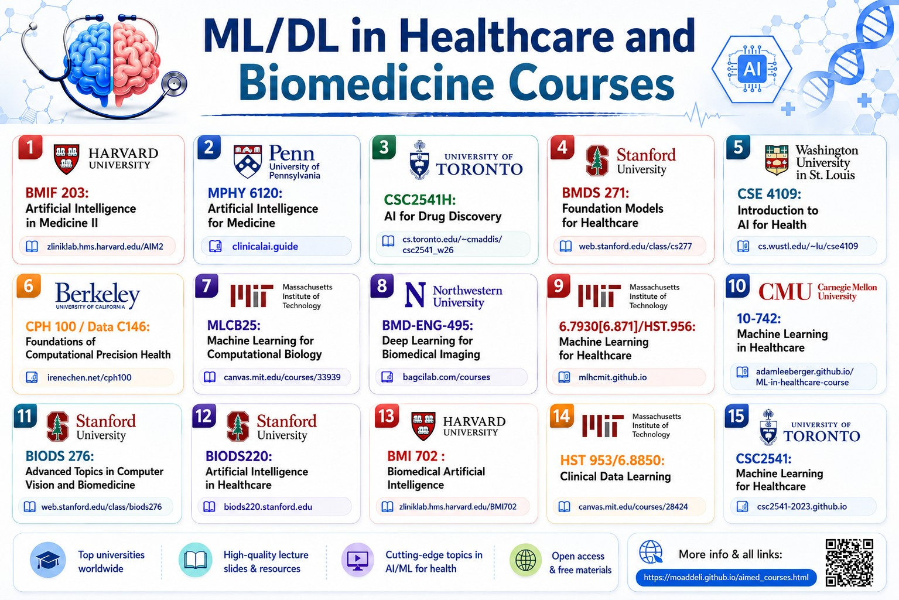

```{=html}
<style>
  /* ── Hero image banner ─────────────────────────── */
  .course-hero-img {
    border-radius: 16px;
    overflow: hidden;
    margin-bottom: 2.5rem;
    line-height: 0;          /* removes gap under img */
    box-shadow: 0 4px 24px rgba(0,0,0,0.10);
  }
  .course-hero-img img {
    width: 100%;
    height: auto;
    display: block;
    object-fit: cover;
  }

  /* ── Course cards grid ─────────────────────────── */
  .courses-grid {
    display: flex;
    flex-direction: column;
    gap: 1rem;
  }

  .course-card {
    background: #ffffff;
    border: 1px solid #e8eef5;
    border-radius: 12px;
    padding: 1.25rem 1.4rem;
    display: flex;
    align-items: flex-start;
    gap: 1.1rem;
    transition: box-shadow 0.22s ease, transform 0.22s ease, border-color 0.22s ease;
    position: relative;
    overflow: hidden;
  }
  .course-card::before {
    content: "";
    position: absolute;
    left: 0;
    top: 0;
    bottom: 0;
    width: 4px;
    background: linear-gradient(180deg, #3b82f6, #8b5cf6);
    border-radius: 4px 0 0 4px;
    transition: width 0.22s ease;
  }
  .course-card:hover {
    box-shadow: 0 8px 30px rgba(59, 130, 246, 0.12);
    transform: translateY(-2px);
    border-color: #c3d9f5;
  }
  .course-card:hover::before {
    width: 6px;
  }

  /* Icon bubble */
  .card-icon {
    width: 42px;
    height: 42px;
    border-radius: 10px;
    background: linear-gradient(135deg, #ebf4ff 0%, #f0ebff 100%);
    display: flex;
    align-items: center;
    justify-content: center;
    font-size: 1.2rem;
    flex-shrink: 0;
  }

  /* Card text */
  .card-body {
    flex: 1;
    min-width: 0;
  }
  .card-title {
    font-size: 0.95rem;
    font-weight: 600;
    color: #1e293b;
    line-height: 1.4;
    margin: 0 0 0.3rem;
  }
  .card-meta {
    display: flex;
    flex-wrap: wrap;
    align-items: center;
    gap: 0.5rem 0.8rem;
    font-size: 0.8rem;
    color: #64748b;
    margin-bottom: 0.5rem;
  }
  .card-meta .uni-badge {
    background: #f1f5f9;
    border-radius: 6px;
    padding: 0.15rem 0.55rem;
    font-weight: 500;
    color: #475569;
  }
  .card-meta .term-badge {
    background: #eff6ff;
    border-radius: 6px;
    padding: 0.15rem 0.55rem;
    font-weight: 500;
    color: #2563eb;
  }
  .card-links {
    display: flex;
    flex-wrap: wrap;
    gap: 0.45rem;
    margin-top: 0.3rem;
  }
  .card-link {
    display: inline-flex;
    align-items: center;
    gap: 0.3rem;
    font-size: 0.78rem;
    font-weight: 500;
    color: #3b82f6;
    text-decoration: none;
    background: #eff6ff;
    border: 1px solid #dbeafe;
    border-radius: 6px;
    padding: 0.2rem 0.6rem;
    transition: background 0.15s, color 0.15s;
  }
  .card-link:hover {
    background: #3b82f6;
    color: #ffffff;
    border-color: #3b82f6;
    text-decoration: none;
  }
  .card-link svg {
    width: 12px;
    height: 12px;
    flex-shrink: 0;
    fill: none;
    stroke: currentColor;
    stroke-width: 2;
    stroke-linecap: round;
    stroke-linejoin: round;
  }
</style>

<div class="course-hero-img">
  
</div>

<div class="courses-grid">

  <!-- 1 -->
  <div class="course-card">
    <div class="card-icon">🧠</div>
    <div class="card-body">
      <div class="card-title">BMIF 203: Artificial Intelligence in Medicine II</div>
      <div class="card-meta">
        <span class="uni-badge">Harvard University</span>
        <span class="term-badge">Spring 2026</span>
      </div>
      <div class="card-links">
        <a class="card-link" href="https://zitniklab.hms.harvard.edu/AIM2/" target="_blank" rel="noopener">
          <svg viewBox="0 0 24 24"><path d="M18 13v6a2 2 0 0 1-2 2H5a2 2 0 0 1-2-2V8a2 2 0 0 1 2-2h6"/><polyline points="15 3 21 3 21 9"/><line x1="10" y1="14" x2="21" y2="3"/></svg>
          Slides &amp; Reading List
        </a>
      </div>
    </div>
  </div>

  <!-- 2 -->
  <div class="course-card">
    <div class="card-icon">🏥</div>
    <div class="card-body">
      <div class="card-title">MPHY 6120: Artificial Intelligence for Medicine</div>
      <div class="card-meta">
        <span class="uni-badge">University of Pennsylvania</span>
        <span class="term-badge">Spring 2026</span>
      </div>
      <div class="card-links">
        <a class="card-link" href="https://clinicalai.guide/" target="_blank" rel="noopener">
          <svg viewBox="0 0 24 24"><path d="M18 13v6a2 2 0 0 1-2 2H5a2 2 0 0 1-2-2V8a2 2 0 0 1 2-2h6"/><polyline points="15 3 21 3 21 9"/><line x1="10" y1="14" x2="21" y2="3"/></svg>
          Course Modules
        </a>
      </div>
    </div>
  </div>

  <!-- 3 -->
  <div class="course-card">
    <div class="card-icon">💊</div>
    <div class="card-body">
      <div class="card-title">CSC2541H: AI for Drug Discovery</div>
      <div class="card-meta">
        <span class="uni-badge">University of Toronto</span>
        <span class="term-badge">Winter 2026</span>
      </div>
      <div class="card-links">
        <a class="card-link" href="https://www.cs.toronto.edu/~cmaddis/courses/csc2541_w26/" target="_blank" rel="noopener">
          <svg viewBox="0 0 24 24"><path d="M18 13v6a2 2 0 0 1-2 2H5a2 2 0 0 1-2-2V8a2 2 0 0 1 2-2h6"/><polyline points="15 3 21 3 21 9"/><line x1="10" y1="14" x2="21" y2="3"/></svg>
          Lecture Slides
        </a>
      </div>
    </div>
  </div>

  <!-- 4 -->
  <div class="course-card">
    <div class="card-icon">🤖</div>
    <div class="card-body">
      <div class="card-title">BMDS 271: Foundation Models for Healthcare</div>
      <div class="card-meta">
        <span class="uni-badge">Stanford University</span>
        <span class="term-badge">Winter 2026</span>
      </div>
      <div class="card-links">
        <a class="card-link" href="https://web.stanford.edu/class/cs277/" target="_blank" rel="noopener">
          <svg viewBox="0 0 24 24"><path d="M18 13v6a2 2 0 0 1-2 2H5a2 2 0 0 1-2-2V8a2 2 0 0 1 2-2h6"/><polyline points="15 3 21 3 21 9"/><line x1="10" y1="14" x2="21" y2="3"/></svg>
          Lecture Slides
        </a>
      </div>
    </div>
  </div>

  <!-- 5 -->
  <div class="course-card">
    <div class="card-icon">🔬</div>
    <div class="card-body">
      <div class="card-title">CSE 4109: Introduction to AI for Health</div>
      <div class="card-meta">
        <span class="uni-badge">Washington University in St. Louis</span>
        <span class="term-badge">Fall 2025</span>
      </div>
      <div class="card-links">
        <a class="card-link" href="https://www.cs.wustl.edu/~lu/cse4109/" target="_blank" rel="noopener">
          <svg viewBox="0 0 24 24"><path d="M18 13v6a2 2 0 0 1-2 2H5a2 2 0 0 1-2-2V8a2 2 0 0 1 2-2h6"/><polyline points="15 3 21 3 21 9"/><line x1="10" y1="14" x2="21" y2="3"/></svg>
          Lecture Slides
        </a>
      </div>
    </div>
  </div>

  <!-- 6 -->
  <div class="course-card">
    <div class="card-icon">🧬</div>
    <div class="card-body">
      <div class="card-title">CPH 100 / Data C146: Foundations of Computational Precision Health</div>
      <div class="card-meta">
        <span class="uni-badge">UC Berkeley</span>
        <span class="term-badge">Fall 2025</span>
      </div>
      <div class="card-links">
        <a class="card-link" href="https://irenechen.net/cph100/" target="_blank" rel="noopener">
          <svg viewBox="0 0 24 24"><path d="M18 13v6a2 2 0 0 1-2 2H5a2 2 0 0 1-2-2V8a2 2 0 0 1 2-2h6"/><polyline points="15 3 21 3 21 9"/><line x1="10" y1="14" x2="21" y2="3"/></svg>
          Lecture Slides
        </a>
      </div>
    </div>
  </div>

  <!-- 7 -->
  <div class="course-card">
    <div class="card-icon">🔭</div>
    <div class="card-body">
      <div class="card-title">MLCB25: Machine Learning for Computational Biology</div>
      <div class="card-meta">
        <span class="uni-badge">MIT</span>
        <span class="term-badge">Fall 2025</span>
      </div>
      <div class="card-links">
        <a class="card-link" href="https://canvas.mit.edu/courses/33939" target="_blank" rel="noopener">
          <svg viewBox="0 0 24 24"><path d="M18 13v6a2 2 0 0 1-2 2H5a2 2 0 0 1-2-2V8a2 2 0 0 1 2-2h6"/><polyline points="15 3 21 3 21 9"/><line x1="10" y1="14" x2="21" y2="3"/></svg>
          Lecture Slides
        </a>
      </div>
    </div>
  </div>

  <!-- 8 -->
  <div class="course-card">
    <div class="card-icon">🫁</div>
    <div class="card-body">
      <div class="card-title">BMD-ENG-495: Deep Learning for Biomedical Imaging</div>
      <div class="card-meta">
        <span class="uni-badge">Northwestern University</span>
        <span class="term-badge">Winter 2025</span>
      </div>
      <div class="card-links">
        <a class="card-link" href="https://bagcilab.com/courses/" target="_blank" rel="noopener">
          <svg viewBox="0 0 24 24"><path d="M18 13v6a2 2 0 0 1-2 2H5a2 2 0 0 1-2-2V8a2 2 0 0 1 2-2h6"/><polyline points="15 3 21 3 21 9"/><line x1="10" y1="14" x2="21" y2="3"/></svg>
          Lecture Slides
        </a>
      </div>
    </div>
  </div>

  <!-- 9 -->
  <div class="course-card">
    <div class="card-icon">⚕️</div>
    <div class="card-body">
      <div class="card-title">6.7930 / HST.956: Machine Learning for Healthcare</div>
      <div class="card-meta">
        <span class="uni-badge">MIT</span>
        <span class="term-badge">Spring 2025</span>
      </div>
      <div class="card-links">
        <a class="card-link" href="https://mlhcmit.github.io/" target="_blank" rel="noopener">
          <svg viewBox="0 0 24 24"><path d="M18 13v6a2 2 0 0 1-2 2H5a2 2 0 0 1-2-2V8a2 2 0 0 1 2-2h6"/><polyline points="15 3 21 3 21 9"/><line x1="10" y1="14" x2="21" y2="3"/></svg>
          Lecture Slides
        </a>
      </div>
    </div>
  </div>

  <!-- 10 -->
  <div class="course-card">
    <div class="card-icon">📊</div>
    <div class="card-body">
      <div class="card-title">10-742: Machine Learning in Healthcare</div>
      <div class="card-meta">
        <span class="uni-badge">Carnegie Mellon University</span>
        <span class="term-badge">Fall 2024</span>
      </div>
      <div class="card-links">
        <a class="card-link" href="https://adamleeberger.github.io/ML-in-healthcare-course/" target="_blank" rel="noopener">
          <svg viewBox="0 0 24 24"><path d="M18 13v6a2 2 0 0 1-2 2H5a2 2 0 0 1-2-2V8a2 2 0 0 1 2-2h6"/><polyline points="15 3 21 3 21 9"/><line x1="10" y1="14" x2="21" y2="3"/></svg>
          Lecture Slides
        </a>
      </div>
    </div>
  </div>

  <!-- 11 -->
  <div class="course-card">
    <div class="card-icon">👁️</div>
    <div class="card-body">
      <div class="card-title">BIODS 276: Advanced Topics in Computer Vision and Biomedicine</div>
      <div class="card-meta">
        <span class="uni-badge">Stanford University</span>
        <span class="term-badge">Fall 2024–2025</span>
      </div>
      <div class="card-links">
        <a class="card-link" href="https://web.stanford.edu/class/biods276/" target="_blank" rel="noopener">
          <svg viewBox="0 0 24 24"><path d="M18 13v6a2 2 0 0 1-2 2H5a2 2 0 0 1-2-2V8a2 2 0 0 1 2-2h6"/><polyline points="15 3 21 3 21 9"/><line x1="10" y1="14" x2="21" y2="3"/></svg>
          Lecture Slides
        </a>
      </div>
    </div>
  </div>

  <!-- 12 -->
  <div class="course-card">
    <div class="card-icon">🔭</div>
    <div class="card-body">
      <div class="card-title">MLCB24: Machine Learning for Computational Biology</div>
      <div class="card-meta">
        <span class="uni-badge">MIT</span>
        <span class="term-badge">Fall 2024</span>
      </div>
      <div class="card-links">
        <a class="card-link" href="https://canvas.mit.edu/courses/28242/modules" target="_blank" rel="noopener">
          <svg viewBox="0 0 24 24"><path d="M18 13v6a2 2 0 0 1-2 2H5a2 2 0 0 1-2-2V8a2 2 0 0 1 2-2h6"/><polyline points="15 3 21 3 21 9"/><line x1="10" y1="14" x2="21" y2="3"/></svg>
          Lecture Slides
        </a>
        <a class="card-link" href="https://www.youtube.com/playlist?list=PLypiXJdtIca4gtioEPLIExlAKvu64z7rc" target="_blank" rel="noopener">
          <svg viewBox="0 0 24 24"><path d="M18 13v6a2 2 0 0 1-2 2H5a2 2 0 0 1-2-2V8a2 2 0 0 1 2-2h6"/><polyline points="15 3 21 3 21 9"/><line x1="10" y1="14" x2="21" y2="3"/></svg>
          Lecture Videos
        </a>
      </div>
    </div>
  </div>

  <!-- 13 -->
  <div class="course-card">
    <div class="card-icon">🧠</div>
    <div class="card-body">
      <div class="card-title">BMI 702: Biomedical Artificial Intelligence</div>
      <div class="card-meta">
        <span class="uni-badge">Harvard University</span>
        <span class="term-badge">Spring 2024</span>
      </div>
      <div class="card-links">
        <a class="card-link" href="https://zitniklab.hms.harvard.edu/BMI702/" target="_blank" rel="noopener">
          <svg viewBox="0 0 24 24"><path d="M18 13v6a2 2 0 0 1-2 2H5a2 2 0 0 1-2-2V8a2 2 0 0 1 2-2h6"/><polyline points="15 3 21 3 21 9"/><line x1="10" y1="14" x2="21" y2="3"/></svg>
          Slides &amp; Reading List
        </a>
      </div>
    </div>
  </div>

  <!-- 14 -->
  <div class="course-card">
    <div class="card-icon">📋</div>
    <div class="card-body">
      <div class="card-title">HST 953 / 6.8850: Clinical Data Learning</div>
      <div class="card-meta">
        <span class="uni-badge">MIT</span>
        <span class="term-badge">Fall 2024</span>
      </div>
      <div class="card-links">
        <a class="card-link" href="https://canvas.mit.edu/courses/28424" target="_blank" rel="noopener">
          <svg viewBox="0 0 24 24"><path d="M18 13v6a2 2 0 0 1-2 2H5a2 2 0 0 1-2-2V8a2 2 0 0 1 2-2h6"/><polyline points="15 3 21 3 21 9"/><line x1="10" y1="14" x2="21" y2="3"/></svg>
          Lecture Slides
        </a>
      </div>
    </div>
  </div>

  <!-- 15 -->
  <div class="course-card">
    <div class="card-icon">🏥</div>
    <div class="card-body">
      <div class="card-title">BIODS 220: Artificial Intelligence in Healthcare</div>
      <div class="card-meta">
        <span class="uni-badge">Stanford University</span>
        <span class="term-badge">Fall 2022–2023</span>
      </div>
      <div class="card-links">
        <a class="card-link" href="https://biods220.stanford.edu/" target="_blank" rel="noopener">
          <svg viewBox="0 0 24 24"><path d="M18 13v6a2 2 0 0 1-2 2H5a2 2 0 0 1-2-2V8a2 2 0 0 1 2-2h6"/><polyline points="15 3 21 3 21 9"/><line x1="10" y1="14" x2="21" y2="3"/></svg>
          Lecture Slides
        </a>
      </div>
    </div>
  </div>

  <!-- 16 -->
  <div class="course-card">
    <div class="card-icon">⚕️</div>
    <div class="card-body">
      <div class="card-title">CSC2541: Machine Learning for Healthcare</div>
      <div class="card-meta">
        <span class="uni-badge">University of Toronto</span>
        <span class="term-badge">Fall 2023</span>
      </div>
      <div class="card-links">
        <a class="card-link" href="https://csc2541-2023.github.io/" target="_blank" rel="noopener">
          <svg viewBox="0 0 24 24"><path d="M18 13v6a2 2 0 0 1-2 2H5a2 2 0 0 1-2-2V8a2 2 0 0 1 2-2h6"/><polyline points="15 3 21 3 21 9"/><line x1="10" y1="14" x2="21" y2="3"/></svg>
          Lecture Slides
        </a>
      </div>
    </div>
  </div>

</div>
```